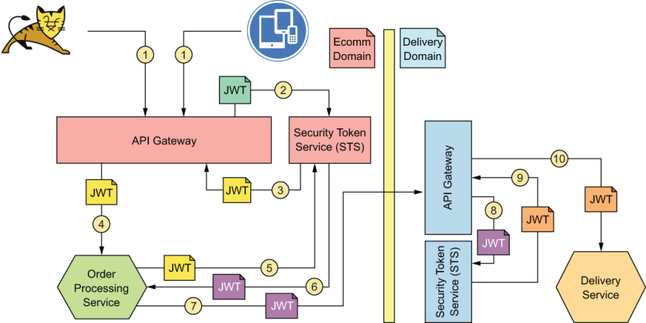
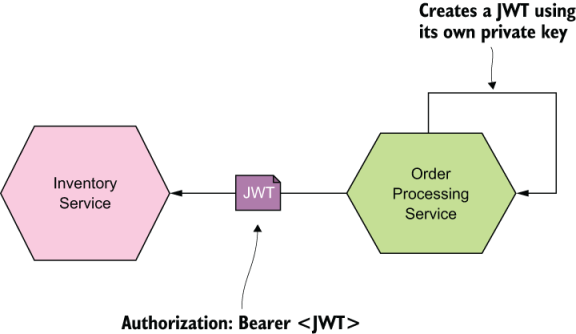
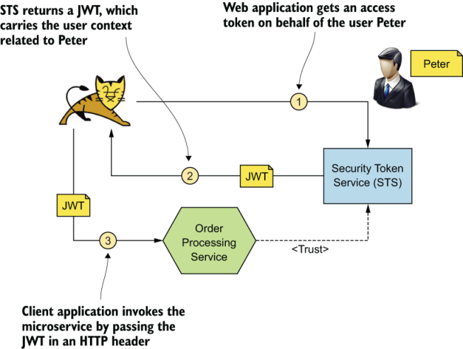
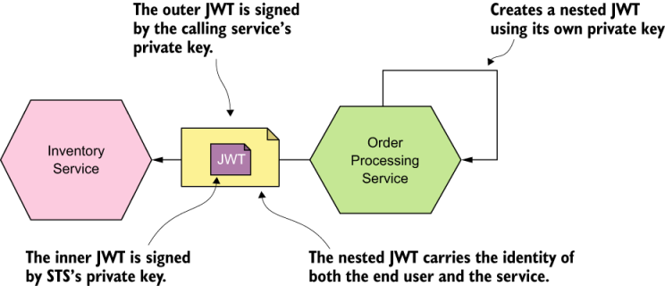
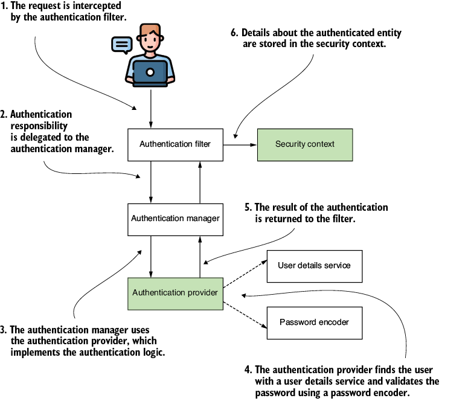

# What is _Realms?_

[___from Oracle Reference___](https://docs.oracle.com/cd/E19798-01/821-1841/6nmq2cpjd/index.html)

- Basic Concept
  - https://docs.oracle.com/cd/E13222_01/wls/docs90/secintro/realm_chap.html#1033627
- 
---

> 보안 영역은 WebLogic 리소스를 보호하기 위한 메커니즘을 포함합니다. 각 보안 영역은 구성된 보안 공급자, 사용자, 그룹, 보안 역할 및 보안 정책 세트로 구성됩니다( 그림 4-1 참조 ). 사용자는 해당 영역에 속하는 모든 WebLogic 리소스에 액세스하기 위해 보안 영역에서 정의되어야 합니다. 사용자가 특정 WebLogic 리소스에 액세스하려고 하면 WebLogic Server는 관련 보안 영역에서 사용자에게 할당된 보안 역할과 특정 WebLogic 리소스의 보안 정책을 확인하여 사용자를 인증하고 권한을 부여하려고 합니다 
> 
> 1. [reference link](https://docs.oracle.com/cd/E13222_01/wls/docs90/secintro/realm_chap.html)
---
영역은 웹 또는 애플리케이션 서버에 대해 정의된 보안 정책 도메인입니다. 서버의 보호된 리소스는 보호 공간 세트로 분할될 수 있으며, 각각은 자체 인증 체계 및/또는 사용자 및 그룹 컬렉션을 포함하는 권한 부여 데이터베이스를 갖습니다. 웹 애플리케이션의 경우 영역은 웹 애플리케이션 또는 웹 애플리케이션 세트의 유효한 사용자로 식별되고 동일한 인증 정책에 의해 제어되는 사용자 및 그룹의 전체 데이터베이스입니다.

Java EE 서버 인증 서비스는 여러 영역의 사용자를 관리할 수 있습니다. file , admin-realm , certificate 영역은 GlassFish Server에 대해 미리 구성되어 있습니다.

파일 영역 에서 서버는 사용자 자격 증명을 로컬로 .이라는 파일에 저장합니다 . 관리 콘솔을 사용하여 파일keyfile 영역 에서 사용자를 관리할 수 있습니다 . 파일 영역을 사용할 때 서버 인증 서비스는 파일 영역을 확인하여 사용자 신원을 확인합니다. 이 영역은 HTTPS 및 인증서를 사용하는 웹 브라우저 클라이언트를 제외한 모든 클라이언트의 인증에 사용됩니다.

인증서 영역 에서 서버는 인증서 데이터베이스에 사용자 자격 증명을 저장합니다. 인증서 영역을 사용할 때 서버는 HTTPS가 있는 인증서를 사용하여 웹 클라이언트를 인증합니다. 인증서 영역에서 사용자의 신원을 확인하기 위해 인증 서비스는 X.509 인증서를 확인합니다. 이 유형의 인증서를 만드는 단계별 지침은 디지털 인증서 작업을 참조하세요 . X.509 인증서의 일반 이름 필드는 주체 이름으로 사용됩니다.

admin -realm 도 파일 영역이며 관리자 사용자 자격 증명을 로컬로 .이라는 파일에 저장합니다 . 관리 콘솔을 사용하여 파일admin-keyfile 영역에서 사용자를 관리하는 것과 같은 방식으로 이 영역의 사용자를 관리할 수 있습니다 . 자세한 내용은 GlassFish Server에서 사용자 및 그룹 관리를 참조하세요 .








JWT is a bearer token. A bearer token is like cash


인증 공급자 이해
엔터프라이즈 애플리케이션에서 사용자 이름과 비밀번호를 기반으로 하는 기본 인증 구현이 적용되지 않는 상황에 처할 수 있습니다
애플리케이션에서 여러 시나리오를 구현해야 할 수 있습니다

https://learning.oreilly.com/api/v2/epubs/urn:orm:book:9781633437975/files/OEBPS/Images/CH06_F02_Spilca4.png


인증 구현


- 사용자 정의를 사용하여 인증 논리 구현 AuthenticationProvider
- Security-Context구성요소 이해 및 관리
- HTTP 기본 및 양식 기반 로그인 인증 방법 사용


AuthenticationProvider은 인증 논리
AuthenticationProvider요청을 인증할지 여부를 결정하는 조건과 지침을 찾을 수 있는 곳


AuthenticationProvider, AuthenticationManager 는 HTTP 필터 계층에서 요청을 수신

SecurityContext현재 인증된 요청과 관련된 세부 정보를 담당

AuthenticationProvider,먼저 인증 이벤트를 설명하는 방법을 이해해야 합니다.여기서는 인증을 나타내는 계약을 살펴보고 알아야 할 방법을 논의합니다.

Authentication는 같은 이름을 가진 프로세스에 관련된 필수 인터페이스 중 하나입니다 인증 요청 이벤트를 나타내며 애플리케이션에 대한 액세스를 요청하는 엔터티의 세부 정보를 보유합니다. 인증 프로세스 중 및 이후에 인증 요청 이벤트와 관련된 정보를 사용할 수 있습니다


액세스를 요청하는 사용자를 principal 이라고 합니다 인증 프로세스가 완료되었는지 여부에 대한 정보와 권한 컬렉션도 추가합니다. 


https://learning.oreilly.com/api/v2/epubs/urn:orm:book:9781633437975/files/OEBPS/Images/CH06_F01_Spilca4.png


OAuth 토큰


OAuth 토큰이란?
구조화된 JSON 웹 토큰(JWT)에 정보 포함
JOSE를 사용하여 토큰 데이터 보호
토큰 내성을 통해 실시간으로 토큰 정보 조회
토큰 취소를 통한 토큰 수명 주기 관리

모든 리디렉션, 흐름 및 구성 요소에 대해 OAuth 프로토콜은 궁극적으로 토큰에 관한 것입니다

토큰이 없으면 OAuth가 없다!
OAuth 토큰이란 무엇인가요?

클라이언트는 권한 부여 서버에서 토큰을 가져와 보호된 리소스에 제공
권한 부여 서버는 토큰을 생성하여 클라이언트에 배포
소스 소유자 위임과 클라이언트 권한을 관리하여 토큰에 첨부
보호된 리소스는 클라이언트로부터 토큰을 수신하여 이를 검증하고 첨부된 권한과 권리를 클라이언트가 요청한 것과 일치시킵니다.

토큰은 위임 행위의 결과
리소스 소유자, 
클라이언트, 
권한 부여 서버, 
보호된 리소스, 
범위 및 권한 
부여 결정에 대한 모든 것의 튜플


클라이언트가 리소스 소유자를 다시 귀찮게 하지 않고 액세스 토큰을 새로 고쳐야 할 때 다른 토큰인 새로 고침 토큰을 사용하여 이를 수행합


토큰을 만들고 검증하는 데는 몇 가지 일반적인 기술

권한 부여 서버가 토큰을 생성
토큰의 값을 디스크의 공유 데이터베이스에 저장
보호된 리소스가 클라이언트로부터 토큰을 받았을 때
토큰의 값을 같은 데이터베이스에서 조회하여 토큰의 용도를 파악
이러한 토큰은 내부에 정보를 담고 있지 않고 대신 간단한데이터 조회를 위한 핸들


권한 부여 서버와 보호 리소스 간에 데이터베이스를 공유하는 것이 항상 실용적인 것은 아닙니다
특히 단일 권한 부여 서버가 다운스트림에서 여러 개의 다른 보호 리소스를 보호하고 있는 경우 더욱 그렇습니다.

그러면 대신 무엇을 할 수 있을까요? 


구조화된 토큰과 토큰 내성

구조화된 토큰: JSON 웹 토큰(JWT)
토큰 정보 온라인 조회: 토큰 내성

JOSE는 토큰의 내용을 암호화하여 보호하는 방법을 제공
JWT는 토큰에 구조화된 정보를 저장하는 방법을 정의

해지를 통해 클라이언트는 발급된 토큰 중 원치 않는 토큰을 삭제하도록 권한 부여 서버에 신호를 보내 토큰 수명 주기를 완료할 수 있습니다.


. 가장 간단한 형태의 JWT인 서명되지 않은 토큰

```
eyJ0eXAiOiJKV1QiLCJhbGciOiJub25lIn0.eyJzdWIiOiIxMjM0NTY3ODkwIiwibmFtZSI6Ikpva
  G4gRG9l이이위YWRtaW4iOnRydWV9.

```

 토큰 문자열을 점 문자로 분할하면 섹션을 별도로 처리
 ```
 eyJ0eXAiOiJKV1QiLCJhbGciOiJub25lIn0
.
아이제이제이디위이오이이엑스엠제이엠0NTY3ODkw이이위브엠FtZSI6이크피바G4gRG9l이이위YWR타W4이온리드WV9

{
  "typ": "JWT",
  "alg": "없음"
}

 ```

 Base64URL로 인코딩된 JSON
왜 Base64인가?

Base64URL 인코딩 체계를 기본적으로 사용함으로써 JWT는 추가 인코딩 없이 이러한 일반적인 위치에 안전하게 배치될 수 있습니다

또한 JSON 객체는 인코딩된 문자열로 제공되므로 처리 미들웨어에서 처리 및 재직렬화될 가능성이 낮습니다.

구체적으로 말하면 URL 안전 알파벳을 사용하고 패딩 문자가 없는 Base64 인코딩입니다.

{
  "typ": "JWT",
  "alg": "없음"
}

---

토큰 자체의 페이로드이며 헤더와 같은 방식으로 직렬화됩니다. Base64URL로 인코딩된 JSON입니다. 이것은 JWT이므로 페이로드는 모든 JSON 객체가 될 수 있으며 이전 예에서는 간단한 사용자 데이터 집합입니다
```
{
  "sub": "1234567890",
  "name": "존 도",
  "admin": 참
}
```

---

JWT 클레임

표준 JSON 웹 토큰 클레임

JWT는 일반적인 데이터 구조 외에도 다양한 애플리케이션에서 사용할 수 있는 클레임 ​​세트를 제공합니다. JWT는 모든 유효한 JSON 데이터를 포함할 수 있지만 이러한 클레임은 이러한 종류의 토큰을 포함하는 일반적인 작업에 대한 지원을 제공합니다. 이러한 모든 필드는 JWT에서 선택 사항이지만 특정 서비스는 자체 포함 요구 사항을 정의할 수 있습니다( 표 11.1 ).

또한 특정 애플리케이션에 필요한 추가 필드를 추가할 수도 있습니다. 이전 예제 토큰에서 페이로드에 name및 admin필드를 추가하여 사용자의 표시 이름과 이 사용자가 관리자인지 여부를 나타내는 부울 필드를 제공했습니다. 이러한 필드의 값은 문자열, 숫자, 배열 또는 다른 객체를 포함한 모든 유효한 JSON 값이 될 수 있습니다

이러한 필드의 이름은 다른 모든 JSON 객체에 해당되는 모든 유효한 JSON 문자열일 수 있지만 JWT 사양 [ 4 ] 에는 JWT 구현 간의 충돌을 피하기 위한 몇 가지 지침이 있습니다. 이러한 지침은 JWT가 다양한 클레임을 정의하고 잠재적으로 서로 다른 의미를 가질 수 있는 보안 도메인에서 사용되도록 의도된 경우에 특히 유용합니다.

 JWT 구현하기
, JWT의 페이로드를 보관할 객체를 만들고 
토큰에서 중요하게 여기는 사항에 따라 필드를 할당
토큰에 대해 동일한 발급자를 권한 부여 서버의 URL로 설정
권한 부여 페이지의 사용자 변수를 토큰의 주체로 사용


credential Entity Table Explain columms Data
---
- SecretData
  - value : "asdlfkjsdalkfjlaskdfjs="
  - salt : "asdfsdfasdfads=="
  - additionalParameter : {}
  
- CredentialData
  - hashIterations : 27500
  - algoritm : "pbkdf2-sha256"
  - additionalParameter : {}
