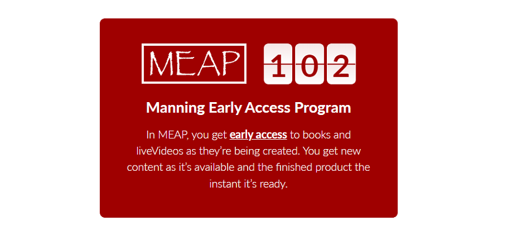

= BOOK title
:chapter: 2
:sectnums:
:figure-caption: Figure {chapter}.
:listing-caption: Listing {chapter}.
:table-caption: Table {chapter}.
:sectnumoffset: 1
// line above:  :sectnumoffset: 5  (chapter# minus 1)
:leveloffset: 1
:imagesdir: ../images/ch02/

= CHAPTER title

This chapter covers

* TEXT
* TEXT

You must use the styles that are defined in this Manning template. For any style that is not defined, use those documented here: https://docs.asciidoctor.org/asciidoc/latest/syntax-quick-reference/

== Level 1 Section Title

Paragraph

=== Level 2 Section Title

Paragraph

==== Level 3 Section Title

Paragraph

=== Lists

Itemized

* level 1
** level 2
*** level 3
**** level 4
***** level 5
* level 1

Ordered

. Step 1
. Step 2
.. Step 2a
.. Step 2b
. Step 3

=== Paragraph level formatting

_italic phrase_
__i__talic le__tt__ers
*bold phrase*
**b**old le**tt**ers
*_bold italic phrase_*
**__b__**old italic le**__tt__**ers
`monospace phrase` and le``tt``ers
`_monospace italic phrase_` and le``__tt__``ers
`*monospace bold phrase*` and le``**tt**``ers
`*_monospace bold italic phrase_*` and le``**__tt__**``ers
^super^script phrase
~sub~script phrase
'`single curved quotes`'
"`double curved quotes`"

[.underline]#underline#

[.line-through]#strikethrough#

[.superscript]#superscript#

//In a standard listing or snippet, limit your code to 76 characters or less.
//A code line with an annotation next to it should be no longer than 55 characters, to leave room for the annotation
//The half column width is 34 characters for the first line, and 28 for subsequent lines.

=== Code listings

This code is shown in listing <<ch2-listing-XYZ-1>>.

//code listing
[#ch2-listing-XYZ-1, reftext={chapter}.{counter:listing}]
.Listing title
[source,java]
----
code code code <1>
----
<1> Annotation

And the code shown in listing <<ch2-listing-XYZ-2>> explains ...

//code listing
[id="ch2-listing-XYZ-2", reftext={chapter}.{counter:listing}]
.Listing with paragraph level formatting
[subs="+quotes,+macros"]
----
code **boldcode** __italicscode__ code <1>
----
<1> Annotation

//code snippet
----
literal code code code
----

==== Figures

[#ch2-figure-XYZ-1, reftext={chapter}.{counter:figure}]
.Figure 1
image::../images/ch02/CH02_F01_LastName.png[,600]

This is a reference for figure <<ch2-figure-XYZ-1>>.

[#ch2-figure-XYZ-2, reftext={chapter}.{counter:figure}]
.Figure 1

This is a reference for figure <<ch2-figure-XYZ-2>>.

This is a reference for table <<ch2-table-XYZ-1>>.

[#ch2-table-XYZ-1, reftext={chapter}.{counter:table}]
.Meaningful table caption
|===
|Column 1 |Column 2 |Column 3

|This is column 1, row 1
|This is column 2, row 1
|This is column 3, row 1

|This is column 1, row 2
|This is column 2, row 2
|This is column 3, row 2
|===

=== Admonition blocks

//Code lines in sidebars should be no longer than 70 characters.

//SIDEBAR
.Custom title
****

Content can contain from regular text, bullet lists, numbered lists to figures

****

//you can't have figures within this kind of block
NOTE: An admonition paragraph
TIP: Pro tip...
IMPORTANT: Don't forget...
WARNING: Watch out for...
CAUTION: Ensure that...

//you can't have figures within this kind of block
[NOTE]
An admonition paragraph...
Second admonition paragraph...
Third admonition paragraph...

//note that the empty line is delimiter for the [NOTE] block or any other [ADMONITION] block
Normal text

//you can have figures here as well
[NOTE]
.Admonition title
====
An admonition block may contain complex content.

A list:

* one
* two
* three

Another paragraph.
====

//you can have figures here as well
[IMPORTANT,definition]
.Definition
====
Text
====

=== Quotes

[quote, Abraham Lincoln, Address at Gettysburg]
____
TEXT
____
